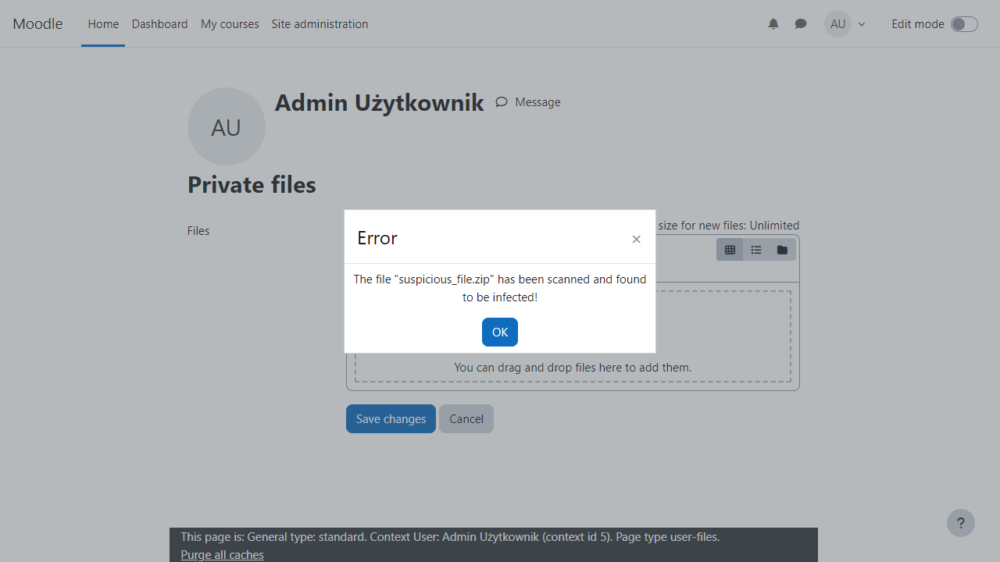

# Safe LMS AV

---------

Safe LMS AV is a powerful antivirus plugin designed specifically for Moodle environments. It automatically scans uploaded files for malware, viruses, and other threats, ensuring that your Learning Management System (LMS) remains secure. The plugin providing real-time protection without disrupting the user experience. With regular updates, Safe LMS AV helps safeguard both educators and students from potential security risks in online learning. Keep your Moodle platform protected with this reliable antivirus solution.

A paid license key is required to use the plugin. This key allows activation and regular updates, ensuring the highest level of protection against threats.

How to obtain a license key?

To get a license key, please contact us. Reach out to us, and we will gladly help you choose the right licensing plan tailored to your needs. Please note that a product key for ESET from the ESET PROTECT line is also required.

 

Thank you for trusting and choosing our software!

 

Contact us at consultations@when2update.com | when2update.com

Developed
===========================
When2Update

Moodle profile: https://moodle.org/user/profile.php?id=3286395

Website: https://when2update.com/

Installation
------------

**First way**

- Clone this repository into the folder lib/antivirus.
- Access the notification area in Moodle and install.

**Second way**

- Download this repository.
- Extract the content.
- Put the folder into the folder report of your Moodle.
- Access the notification area in Moodle and install.

**Third way**

- Download this repository.
- Access the install plugins area in Moodle
- Upload repository with file picker
- Click Install plugin from the zip file

